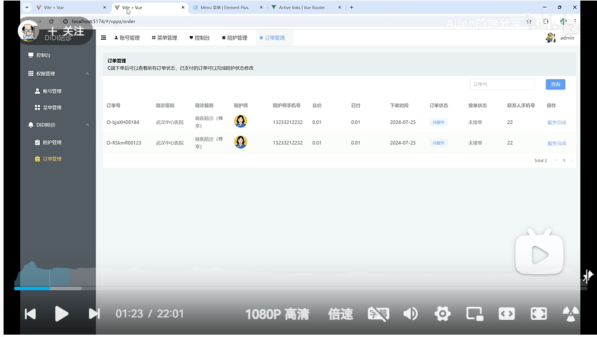

# Vue 3 + Vite

This template should help get you started developing with Vue 3 in Vite. The template uses Vue 3 `<script setup>` SFCs, check out the [script setup docs](https://v3.vuejs.org/api/sfc-script-setup.html#sfc-script-setup) to learn more.

Learn more about IDE Support for Vue in the [Vue Docs Scaling up Guide](https://vuejs.org/guide/scaling-up/tooling.html#ide-support).

### 系统图

左侧菜单一级导航有控制台、权限管理（账号管理、菜单管理）、DIDI陪诊（陪护管理、订单管理）
### 技术栈vue3+vite
用vite搭建项目
``` 
  npm create vite@latest vue3-app -- --template vue
```
安装vue router
```
  npm install vue-router@4
```
### 路由创建
1.创建路由和对应页面，views的Main.vue和views/login/index.vue
2.引入vur-router创建路由实例，router/index.js
3.挂载到router到vue实例上，main.js
4.对应页面使用<RouterView />配置路由显示,App.vue

### Element plus
1.下载element plus
```
  npm install element-plus --save
```
2.按需引入
下载插件
```
  npm install -D unplugin-vue-components unplugin-auto-import
```
修改vite.config.js配置文件

### 下载图标icon
1.下载icon
2.全局注册icon组件

### 下载pinia作为状态管理工具
它们有什么区别吗？
1.设计理念
- vuex：
  1.vuex是vue.js官方的状态管理工具，专为vue生态系统设计
  2.它采用了Flux架构，强调单项数据流和集中式状态管理
- Pinia:
  1.Pinia是一个较新的状态管理库，旨在成为Vue3的官方状态管理解决方案
  2.它简化了状态管理的概念，更加灵活且易于使用，特别适合与Vue3的组合式API一起使用
2.API设计
- Vuex：
  1.使用模块化的方式管理状态，每个模块都有自己的state、getter、mutations和actions
  2.需要手动定义mutations来更改状态，增加了代码的复杂性
- Pinia:
  1.使用store的方式管理状态，store可以直接定义state、getters和actions，简化了API
  2.不需要使用mutations,actions可以直接修改状态，使用起来更直观
3.类型支持
- Vuex：对Typescipt的支持相对较弱，需要手动定义类型
- Pinia:对Typescript提供了更好的支持，能够自动推断类型，使用体验更佳
4.状态管理方式
- Vuex:
  1.状态是集中式的，适合大型应用，状态管理结构较为复杂
  2.在响应式方面，Vuex的状态是响应式的，但需要使用Vue的响应式API
- Pinia:
  1.支持对每个store单独进行响应式管理，使用Composition API,使得状态管理更加灵活
  2.提供了更简单的API和更好的性能
5.开发工具：
- Vuex：提供了Vue Devtools插件，可以方便地调试状态
- Pinia:也支持Vue Devtools,但提供了更直观的状态和行为监控


